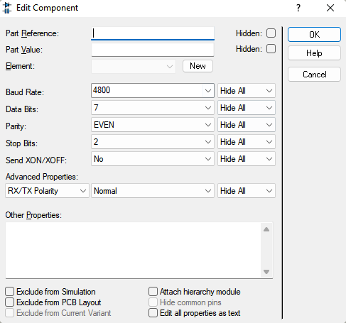

# Proteus  

## Зміни, які треба бахнути в Proteus

Відповідно до байту передачі:  
(0b01101010)

Відповідно до параметрів варіанту:

## Робота з усім іншим
(насправді, це все просто інструкції з методички з цієї лаби. там краще, там є скріни...)

- Щоб відкрити закриті термінал та осцилоскоп: Debug -> *..

- Юзайте Debug -> Start VSM Debugging, потім пуск та паузу симуляції (власне.. кнопки Start, Pause)

- Перед вводом символу жмякніть Echo Typed Characters та Hex D. Mode в терміналі

- Перед пуском симуляції жмякніть One Shot на осцилоскопі
