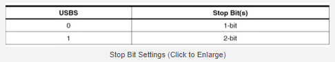
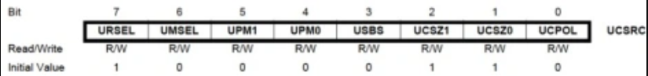
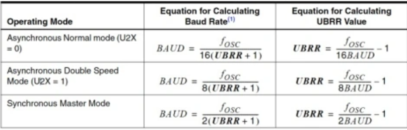
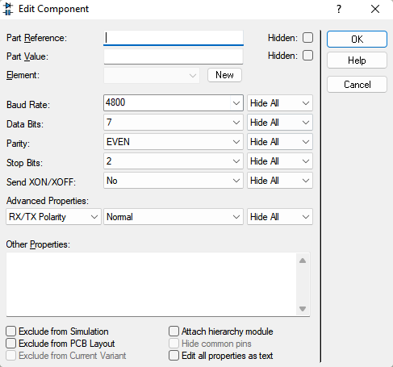

# Як налаштовується USART
## Налаштування в програмі
Взагалі, оскільки UART - окремий модуль, можна було б говорити про нього, як про окремий мікроконтролер, його транзистори тощо. Але на рівні абстракції, який потрібен для цієї курсової, да і, власне, просто для використання цього модулю, достатньо поговорити лише про те, як налаштувати модуль в програмі.

Програмування модулю відбувається шляхом запису певних даних до певних регістрів модулю в залежності від бажаної поведінки модуля. Наприклад, за кількість стоп-бітів, які будуть передані при передачі даних (і на які буде очікувати модулю при прийомі даних), відповідає USBS біт регістру UCSRC.



А так виглядає частина мого коду, що формує регістр UCSRC, який відповідає за налаштування режиму роботи модулю, parity, кількість стоп-бітів та кількість бітів даних.  
```
   ; 7 бітів даних, перевірка на парність, 2 стоп-біти
ldi   R16, (1<< URSEL)|(1<<UPM1)|(1<<UPM0)|(1<< UCSZ1)|(0<< UCSZ0)|(1<<USBS) 
   ; URSEL 1 means we write to UCSRC (not UBRRH)
   ; UPM1,0 set to 1,1 - odd parity (outputs 0 if EVEN | 1 if ODD)
   ; UCSZ2,1,0 set to 0,1,0 - 7 data bits
   ; USBS set to 1 - 2 stop bits
out   UCSRC, R16			; UCSRC <- R16 
```
Формування регістру відбувається через бінарні здвиги (<<) та бінарний OR (|).   
Коротше кажучи, можна сісти з олівцем і легко розібратись.

Аналогічним чином налаштовується і регістр UCSRB, що відповідає за налаштування модуля UART в цілому (типу, чи ввімкнена взагалі передача через UART, тощо). Втім, всі завдання цієї курсової використовують однакові налаштування, тому цю частину можна залишити без змін.
```
ldi   R16, (1<<RXEN)|(1<<TXEN)|(0<<RXCIE)|(1<<TXCIE)|(1<<UDRIE)
   ; RXEN - UART Receiver enable
   ; TXEN - UART Transmitter enable
   ; RXCIE - UART RX Complete Interrupt Enable (0 - disabled)
   ; TXCIE - UART TX Complete Interrupt Enable
   ; UDRIE - UART Data Register Empty Interrupt Enable 
out   UCSRB, R16		          ; write settings above to their corresponding UCSRB register
```

Власне кажучи, для більш повного розуміння всіх бітів/регістрів, знову відсилаю на [статтю](https://maxembedded.com/2013/09/the-usart-of-the-avr/).

Останнє, що нам залишилося налаштувати з умови курсача - швидкість передачі даних через модуль.
Long story short, в нас є тактова частота мікропроцесора, і ми можемо поділити її на 16 або на 8 (якщо ми передаємо дані в асинхронному режимі, тобто в один момент часу або передаємо або приймаємо. Якщо хочемо одночасно і передавати і приймати (синхронний режим), швидкість буде нижчою). А потім вона ще поділиться на значення, записане в регістрі UBRR :)) 

(*насправді, в цьому діленні і регістрі UBRR є фізичний сенс. Регістр UBRR працює як лічильник - рахує від свого значення до нуля і, коли досягає нуля, викликає один біт передачі через UART)

## Налаштування Virtual Terminal в Proteus
Оскільки для коректної роботи UART необхідно, щоб обидва модулі (які приймають/передають одне одному дані) мали попередньо узгоджені однакові налаштування передачі, нам необхідно налаштувати ще й Virtual Terminal (в якому, власне, теж емулюється UART - оскільки UART мікроконтролера приймає з UART терміналу символ). Зверніть увагу на інвертованість parity, описану в розділі Parity.
