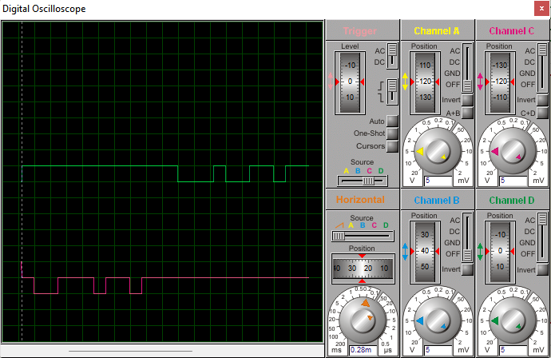

# Що ми взагалі створюємо?

Ідея курсової в тому, щоб просимулювати роботу вбудованого в мікроконтролер модуля УАПП (UART. Це просто окремий модуль, який відповідає за прийом/передачу даних. Про UART далі).

Програма на Асемблі, якою ми прошиваємо мікроконтролер, спочатку считує символ, який ми вводимо в Virtual Terminal. Virtual Terminal працює в ASCII, тобто наш символ переводиться в двійковий код, який у вигляді 1/0 відправляється до мікроконтролеру в такому форматі, ніби ми відправили його через UART. UART мікроконтролера зчитує надіслані біти і відображає їх на світлодіодах.

Потім мікроконтролер зчитує біти, які ми формуємо за допомогою кнопок і надсилає їх через свій UART.

Те, як фізично в плані бітів відбувається передача, ми спостерігаємо на осцилоскопі.

## UART
(Взагалі, майже всі пікчі та інфа про регістри [звідси](https://maxembedded.com/2013/09/the-usart-of-the-avr/). Стаття кайф)

В мікроконтролері є окремі вбудовані (вони доволі буквально всередині корпусу) модулі, які потрібні, щоб передати іншим мікроконтролерам/дисплею тощо дані. Один з таких модулів (в якого, очевидно, є свій окремий формат передачі даних) - UART. Щоб зрозуміти, в чому прикол, почитайте вікі або статтю.

## Фінальний результат

В варіанті курсової задано швидкість передачі даних, самі дані та деякі налаштування формату передачі.

Ми налаштовуємо проєкт, трохи змінюємо код програми, яка відповідає за прийом/передачу та побітово описуємо результати передачі, які ми бачимо на осцилоскопі (вони мають, очевидно, співпадати з тим, що ми передали та в якому форматі).